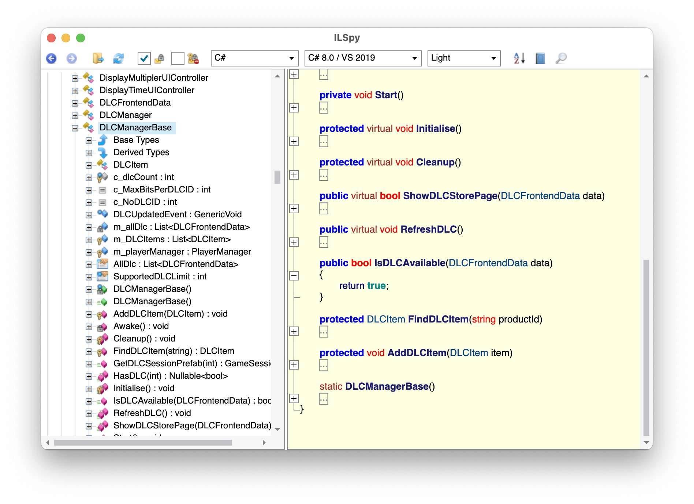

# Overcooked2 DLC unlock

## Usage

Download the file here:

- [epic](https://github.com/shinohara-rin/overcooked_all_dlc_patch/raw/master/epic/Assembly-CSharp.dll) (tested on windows 10)shasum:48c5f86a013ca7328c10333cc3e211701b49c841
- steam (in case anyone need a beta branch patch feel free to open an issue!)
	- [osx](https://github.com/shinohara-rin/overcooked_all_dlc_patch/raw/master/steam/osx/Assembly-CSharp.dll) (tested on macbook m1) shasum:b18bec6a42484348c202e8fa7a8f235c16eb3cf8
	- [windows](https://github.com/shinohara-rin/overcooked_all_dlc_patch/raw/master/steam/windows/Assembly-CSharp.dll) (tested on windows 10) shasum:2a927ba57f38c9346371a63c78bd8281eaa0983d

Replace `Overcooked2_Data\Managed\Assembly-CSharp.dll`(Windows) or `Overcooked2.app/Contents/Resources/Data/Managed/Assembly-CSharp.dll`(macOS) with the file corrisponding to your game platform.

you might need to re-apply the patch after an update.

special thanks [AlotOfBlahaj](https://github.com/AlotOfBlahaj)

## How it works

it's not that fancy, just return true.
